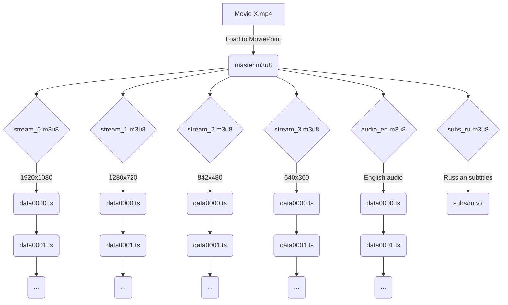

# MoviePoint

Написанный на Python сайт-сервис предоставляет возможность хранить информацию о фильмах и сериалах. Вы можете загружать медиа-контент сами, ставить оценки и писать рецензии — все это будет доступно после регистрации на сайте.


# Технические особенности

Ниже приведены технические особенности MoviePoint

## Использование Flask

Фреймворк **Flask** предоставляет возможность создания быстрого приложения с возможностью его будущего масштабирования.

## Библиотека SQLAlchemy

Библиотека для работы с БД SQLAlchemy применяет технологию ORM (Object-Relational Mapping), т. е. дает возможность для синхронизации объектов Python.

## REST API

Все запросы БД выведены как отдельные API как независимые программные компоненты.

## HLS

В основе работы HLS (HTTP Live Streaming) лежит принцип разбиения цельного потока на небольшие фрагменты, последовательно скачиваемые по HTTP. Это позволяет при просмотре видео не скачивать полностью весь медиафайл (его объем может быть больше 10Гб!), а загружать видео по частям, по мере просмотра клиентом предыдущих фрагментов.

## Хранение видео в нескольких разрешениях

Проигрыватель сайта предоставляет возможность выбрать качество просматриваемого клиентом видео. Каждое видео представляет из себя множество одинаковых медиафайлов, отличавшихся по разрешению. Их объединяет общий плейлист формата **m3u8**, который направляет проигрыватель, какие файлы загружать в зависимости от выбранного разрешения.



## Инструкция по настройке и запуску

Перед включением сайта в конфигурационном файле server.ini, укажите путь для сохранения фильмов и сериалов (*MediaDataPath="_ЗДЕСЬ УКАЖИТЕ ПУТЬ_"). Рекомендуется указывать отдельную пустую папку, располагающуюся на диске с большим объемом.

В указанную директорию расположите три исполняемых файла, приложенных в архиве HLS_Attachments.zip

Не забудьте установить все библиотеки и фреймворки, описанные в файле `requirements.txt`.

Для запуска сайта достаточна одна команда:

```shell
python main.py
```

Чтобы стать _администатором_ на сайте, создайте учётную запись и укажите свой идентификатор (ID типа базе данных) в файле admins.txt (если администраторов несколько, укажите каждого в новой строке). Перезапустите приложение, и изменения вступят в силу.
С правами _администратора_ можно редактировать опубликованные другими пользователями фильмы и сериалы.
